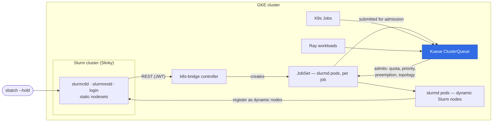
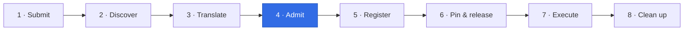

# k8s-bridge — system and code architecture

Audience: engineers picking up this prototype for productization. Everything
here was validated live on GKE unless marked otherwise; deviations from the
original design are tracked in ADRs.

## 1. Problem in one sentence

Run Slurm batch jobs, Kubernetes batch, Ray workloads, and inference services
on **one pool of accelerated infrastructure**, with **Kueue as the single
admission authority** for quota, priority, and preemption — instead of ceding
cluster control to Slurm (the Slurm Bridge model).

## 2. System overview

The detailed control flow for the Slurm path:



Key inversion vs. Slurm Bridge: each Slurm job gets its own short-lived set of
Slurm nodes, materialized as pods that Kueue admitted from the shared quota;
Slurm never schedules onto foreign nodes.

<details>
<summary>Plain-text (ASCII) version of the same diagram</summary>

```
                 ┌─────────────────────────────────────────────────────────┐
                 │                    GKE cluster                          │
                 │                                                         │
  sbatch --hold  │  ┌──────────────┐   REST (JWT)    ┌──────────────────┐  │
 ───────────────►│  │ Slurm cluster │◄───────────────│    k8s-bridge    │  │
                 │  │ (Slinky)      │                │   (controller)   │  │
                 │  │  slurmctld    │                └───────┬──────────┘  │
                 │  │  slurmrestd   │                        │ creates     │
                 │  │  login        │                        ▼             │
                 │  │  static       │                ┌──────────────────┐  │
                 │  │  nodesets     │                │     JobSet       │  │
                 │  └──────▲───────┘                 │ (slurmd pods)    │  │
                 │         │ register as             └───────▲──────────┘  │
                 │         │ dynamic nodes                   │ admits      │
                 │         │                                 │ (quota,     │
                 │  ┌──────┴───────┐                 ┌───────┴──────────┐  │
                 │  │ slurmd pods  │                 │      Kueue       │  │
                 │  │ (per job)    │                 │  ClusterQueue    │  │
                 │  └──────────────┘                 └───────▲──────────┘  │
                 │                                           │ same queue  │
                 │      K8s Jobs ──────────────────────────► │             │
                 │      Ray workloads ─────────────────────► │             │
                 └─────────────────────────────────────────────────────────┘
```

</details>

Slurm keeps its user interface (sbatch/squeue) and in-job orchestration;
Kubernetes keeps cluster sovereignty.

## 3. The lifecycle (validated end to end, 2026-07-04)



1. **Submit**: user runs `sbatch` into a workload-mixing partition. A lua
   JobSubmit plugin auto-holds the job with a comment and rejects array jobs
   with a clear message (`experiments/01-gke-playground/manifests/slurm-values.yaml`,
   installed by `experiments/01-gke-playground/scripts/02-install-components.sh`)
   — `--hold` is no longer a manual convention, it is enforced at submit time.
   Plain `sbatch` (no `--hold`) now flows end to end.
2. **Discover**: the bridge polls `GET /slurm/v0.0.44/jobs`, filters
   pending+held jobs in configured partitions, processes oldest-first.
3. **Translate**: each job becomes a JobSet named `slurm-job-<id>`:
   one pod per Slurm task; `cpus-per-task`/`mem-per-cpu` become pod
   requests; the partition maps to a Kueue `WorkloadPriorityClass`;
   pods run `slurmd -Z --conf "Features=nodes-for-<id> CPUs=… RealMemory=…"`.
4. **Admit**: Kueue admits the JobSet when quota allows (triggering GKE
   autoscaling if needed) — the Slurm job consumes the same quota as every
   other workload class.
5. **Register**: slurmd pods register as dynamic Slurm nodes named after the
   pod hostnames (deterministic: `slurm-job-<id>-workers-0-<n>`).
6. **Pin & release** (ADR-0005): the bridge retries
   `constraints=nodes-for-<id>` until Slurm accepts it (which proves the
   nodes registered), then lifts the hold. Slurm immediately schedules the
   job onto its dedicated nodes — no other job can use them (feature match),
   and this job can use no other nodes.
7. **Execute**: Slurm runs the job natively (srun, steps, epilog…).
8. **Clean up**: when the job reaches a terminal state (or vanishes past
   MinJobAge), the bridge deletes the Slurm node records (names are
   computable) and the JobSet. Resources return to the shared pool.

## 4. Code architecture

```
cmd/k8s-bridge/main.go      wiring: config, schemes, Manager, watches, signal handling
internal/config             YAML config (mirrors the future WorkloadMixing CRD; ADR-0004)
internal/slurm              minimal slurmrestd client (v0.0.44 data parser)
internal/translate          Slurm job -> JobSet mapping (the heart of the bridge)
internal/bridge             reconcile loop: discover / admit / release / cleanup / watch-nudge / hot-reload
internal/metrics            Prometheus collectors, registered on controller-runtime's own registry
```

Design decisions an engineer should know:

- **Polling as the correctness backbone, watches as a latency nudge**
  (ADR-0011) — slurmrestd cannot be watched, so the timer-driven `tick()`
  loop remains authoritative; a controller-runtime `manager.Manager` adds
  JobSet/Kueue-Workload watches that call `Bridge.Nudge()` to run the next
  tick immediately instead of waiting out `pollInterval`, coalesced (a
  buffered-size-1 channel) so a burst of events never becomes a tick storm.
  `Bridge.Run` is registered as a plain `manager.RunnableFunc`, which
  controller-runtime starts only after the informer caches sync AND this
  replica has won leader election (verified by reading
  `pkg/manager/internal.go`'s `Caches → Others → LeaderElection` start
  ordering, and by `TestBridgeRunGatedByLeaderElection`). `tick()`'s own
  logic — `admitHeldJobs`, `cleanupFinishedJobs`, etc. — is completely
  unchanged by any of this; rollback is a pure `main.go` wiring revert (see
  ADR-0011's Consequences).
- **Leader election, on by default** — `--leader-elect` (default `true`)
  gates the reconcile loop behind winning a `coordination.k8s.io` Lease
  (`k8s-bridge-leader`), so a second bridge replica sits idle instead of
  double-processing/double-creating JobSets. The Lease's namespace prefers
  the `POD_NAMESPACE` downward-API env var the chart injects, falling back
  to the WorkloadMixing CR's namespace, then `default` — getting this wrong
  was bug B1 in the first live chart deploy (leader election was forbidden
  under the chart's namespaced RBAC until the Lease target matched it; see
  `docs/VALIDATION.md`).
- **Namespace-scoped informer cache** — the Manager's cache defaults to
  cluster scope, but the chart grants only a namespaced `Role` (least
  privilege, SEC2). `cacheScopedToNamespace()` in `main.go` confines the
  cache to `POD_NAMESPACE` so its LIST/WATCH calls match that RBAC; this is
  safe because the chart guarantees `config.namespace == release namespace
  == POD_NAMESPACE` by construction. Getting this wrong (bug B8) silently
  hung the pod at not-Ready forever, because a cluster-scoped LIST/WATCH
  came back forbidden and the cache never synced. JobSet LISTs are served
  from this cache (closing backlog P8 for JobSets); Kueue Workload LISTs
  are deliberately **not** cached — see the P8 note below.
- **Idempotency by naming** — JobSet names are deterministic
  (`slurm-job-<id>`), so create-or-exists replaces state tracking; a bridge
  restart is harmless.
- **Slurm validation as readiness signal** (ADR-0005) — no separate
  node-registration poller; the constraint update either sticks or tells us
  to wait.
- **Warnings are errors** — slurmrestd answers `200 OK` with the real outcome
  in `errors`/`warnings` arrays; the client fails hard on both (a silently
  ignored update cost us an hour of debugging). Production should generate
  the client from the OpenAPI spec.
- **One failure domain per tick, with an explicit dead-JobSet exception
  (D1)** — any transient error aborts the tick and is retried whole;
  permanent (translation) errors skip the job and are logged/counted, and
  emit a `TranslationFailed` Warning Event. Separately, if a JobSet reaches
  a `Failed` condition (e.g. `activeDeadlineSeconds` fired before the
  Slurm job's dynamic nodes ever registered) before its Slurm job could
  run, `jobSetFailed`/`failJobForDeadJobSet` (`reconciler.go`) now write an
  explanatory Slurm comment, cancel the Slurm job via `CancelJob`, and emit
  a `JobSetFailed` Warning Event — instead of leaving that job pending
  forever, which was the live defect this closes. If the cancel call
  itself fails (e.g. slurmrestd unreachable), the JobSet is deliberately
  left in place so the next tick retries the whole failure path — deleting
  it would strand the job with no record to retry against.
- **Merged admission mutation (P2)** — the `constraints` (node-locking
  Feature) and `hold:false` (release) fields travel in a single Slurm
  job-update REST call instead of two sequential POSTs, halving
  per-admission mutations; the admission gate (Kueue admitted first) is
  unaffected by the merge.
- **Comment-rewrite throttle (P3)** — the Slurm `comment` field (the
  squeue-visible "why is this job waiting" signal) is only rewritten on a
  status-class *transition*, gated additionally by a minimum interval
  (`commentRewriteMinInterval`), using a cross-tick `commentState` map
  keyed by Slurm job ID. Without this, a large backlog wrote a comment
  update for every held job on every tick regardless of whether anything
  meaningful changed (2500 rewrites observed in one burst pre-fix); the map
  is pruned every tick for job IDs no longer present, so it stays bounded.
- **Streaming job-list decode (P4)** — `ListJobs` decodes the `/jobs`
  response incrementally (`listJobsStreaming`, `json.Decoder`) instead of
  buffering the whole multi-MB response body in memory. slurmrestd v0.0.44's
  OpenAPI spec has no page/limit/cursor parameter on this endpoint, so true
  server-side paging is not available; streaming decode is the equivalent
  fix for the same memory-bound problem on a large backlog.
- **Parallel JobSet creation (P5)** — within `admitHeldJobs`, JobSet
  creation for the tick's held jobs is parallelized across a bounded worker
  pool (`createJobSetsParallel`, sized by `cfg.CreateWorkers`, default 8),
  with per-job failure isolation: one job's create failing is logged,
  counted, and skipped, without aborting the other jobs in the same tick.
  The oldest-first admission ordering and the "admit only after Kueue
  admission" gate still run sequentially afterward, unaffected by which
  worker created which JobSet.

## 4a. Topology-aware scheduling (ADR-0008)

Slurm's `--switches=N` becomes a Kueue TAS constraint on the slurmd pods:

| Slurm request | Bridge translation | Effect |
|---|---|---|
| `--switches=N` (N>0) | `kueue.x-k8s.io/podset-required-topology: <level>` | all task pods admitted into ONE domain at that level (e.g. one rack) or the job waits |
| none | `kueue.x-k8s.io/podset-preferred-topology: <level>` | best-effort co-location, falls back to scattering |

Mechanics: a cluster-scoped `Topology` CR declares the hierarchy as ordered
node label keys (block → rack → hostname); a `ResourceFlavor` with
`topologyName` scopes TAS to labeled nodes; Kueue computes the domain
assignment at admission and steers each pod via injected selectors. Because
TAS reads only node labels, the playground simulates a 2-block × 2-rack
datacenter with a labeling script (`experiments/05-topology/`) — behaviorally
identical to a real GKE topology, where the same levels map to
`cloud.google.com/gce-topology-{block,subblock,host}`.

The locality then transfers transparently: Slurm schedules onto its dynamic
nodes, and those nodes ARE the co-located pods — Slurm never needs to know
the Kubernetes topology exists.

## 4b. Priority mutation channel (ADR-0009)

Priorities are mutable, including for already-running jobs, but Slurm's own
`priority` field cannot be the data channel — live testing showed Slurm
continuously recomputes it (age factor) and treats `0` as HOLD, which
re-held a running job when the bridge tried a three-way mirror. The
supported channel instead runs through an `admin_comment` directive:

| Step | Actor |
|---|---|
| `scontrol update job <id> priority=N` | Slurm user |
| lua JobSubmit hook intercepts the raw field change, rejects it, and records the request as a `wm:prio=N` directive in `admin_comment` | Slurm (lua plugin) |
| bridge reads the directive and patches `Workload.spec.priority`, capped at `maxUserPriority` (config) | bridge (`kueue.go`) |
| ack written back as `wm:prio-applied=N` | bridge → Slurm comment |

Kueue's `Workload.spec.priority` is mutable by design and re-ranks
preemption-victim selection immediately, even for admitted/running
workloads — validated live. The experimental Slurm-field mirror stays in the
code behind `enablePrioritySync` (default off) as a cautionary artifact.

## 4c. Simulated accelerators (ADR-0010)

GPU E2E is exercised without real hardware by simulating both halves of the
chain: the Kubernetes side gets a fake extended resource
(`nvidia.com/gpu: N` patched onto node `status`), which Kueue quota and the
scheduler treat exactly like a real device; the Slurm side needs a
`gres.conf` device entry for slurmd's GRES verification to accept the type
(`Name=gpu File=/dev/null` — GPU GRES requires `File=`, and configless Slurm
does not distribute `gres.conf` on its own), which the bridge mounts as a
ConfigMap into the slurmd pod's conf-cache for GPU jobs. Validated end to
end: `sbatch --gres=gpu:1` → JobSet requesting `nvidia.com/gpu` → Kueue
admission → dynamic node advertising `gpu:1` → Slurm GRES scheduling →
completion → cleanup. Real-GPU runs shrink to a hardware smoke test (driver +
CUDA visibility) once quota exists.

## 5. Configuration surface

Dual-source, promoted in a later iteration (ADR-0004's anticipated path): the bridge
loads its `Config` from either a YAML file (`--config`, still the schema
preview described below — useful for laptop/local runs) or a live
`WorkloadMixing` CR (`--workloadmixing <ns>/<name>`), both sharing one
`ApplyDefaults`/`Validate` pair. CR mode is the in-cluster production path:
Slurm REST endpoint + JWT, target namespace + LocalQueue,
partition→WorkloadPriorityClass mappings (each optionally overriding
`localQueue` for multi-team routing — backlog A1b), and the slurmd pod
template (image, conf-server, auth secret) all come from the CR spec, and
the bridge reports health back onto `status.conditions` (`Ready`, observed
live — flips to `False` on tick failures, back to `True` on recovery). CR
mode now **hot-reloads**: a controller-runtime watch (ADR-0011) re-reads the
CR on every spec change and atomically swaps the bridge's live config, no
restart required; a reload that fails validation is reported on
`status.conditions` and the bridge keeps running on its last-good config.
File mode has no CR to watch and stays a one-shot load at startup.

## 5a. Observability (AUD2, ADR-0011)

All of the following are shipped and live-validated, not aspirational:

- **One consolidated HTTP surface** (`--metrics-addr`, default `:8080`):
  `/metrics` (Prometheus), `/healthz`, `/readyz` on a single mux/port —
  deliberately kept as the bridge's own mux rather than the Manager's
  built-in metrics/health servers, because those are two separate listeners
  with no supported way to merge onto one port, and the chart's
  probes/Service assume exactly one. The Manager's own metrics and health
  servers are disabled (`BindAddress: "0"`).
- **Prometheus metrics** register on controller-runtime's own
  `sigs.k8s.io/controller-runtime/pkg/metrics.Registry` (not a private
  one), so `/metrics` also carries the CNCF-standard controller-runtime
  series (`rest_client_*`, `leader_election_master_status`) for free:
  `k8s_bridge_tick_duration_seconds` (histogram), `k8s_bridge_ticks_total` /
  `k8s_bridge_tick_errors_total`, `k8s_bridge_jobsets_created_total` /
  `k8s_bridge_jobsets_deleted_total` / `k8s_bridge_jobset_create_errors_total`,
  `k8s_bridge_jobs_failed_total` (D1's counter), `k8s_bridge_held_jobs`
  (gauge), `k8s_bridge_slurm_api_requests_total{method,code}`,
  `k8s_bridge_job_release_latency_seconds` (histogram: time from a job
  first observed held+pending to being released onto its dynamic nodes —
  cross-tick `seenAt` map, pruned every tick), and
  `k8s_bridge_tick_trigger_total{source="timer|watch"}` (ADR-0011: makes
  the watch-nudge's effect on tick cadence observable).
- **Kubernetes Events** land on JobSets via the Manager's
  `EventRecorder` (`mgr.GetEventRecorderFor("k8s-bridge")`): Normal
  `Created`/`Released`, Warning `JobSetFailed`/`TranslationFailed` — so
  `kubectl describe jobset` tells a Slurm-adjacent operator what happened,
  which it could not before. Every call site nil-checks the recorder, so
  tests and any future call path with no recorder wired simply get no
  Events.
- **Leader election** via a `coordination.k8s.io` Lease
  (`k8s-bridge-leader`), default on (`--leader-elect`) — see the Lease
  namespace note in §4.
- **Structured JSON logs** to stdout (`log/slog`), level controlled by
  `--log-level` (`debug`/`info`/`warn`/`error`); controller-runtime's own
  logr output is routed into the same `slog` handler
  (`ctrl.SetLogger(logr.FromSlogHandler(...))`) — without this wiring,
  controller-runtime silently drops its own internal errors (this hid the
  cache-sync failure behind bug B8 until it was added).
- **Ready condition** on the WorkloadMixing CR (CR mode only):
  `status.conditions` flips `Ready=False` on tick failure, `True` on
  recovery, with `observedGeneration` tracking which spec generation the
  status reflects. Conditions are standard `metav1.Condition` since
  ADR-0014 PR 2 — earlier CRD schemas silently pruned `observedGeneration`
  even though the controller stamped it, so under the pre-migration CRD
  the field never actually persisted.

`pprof` remains a separate, explicitly opt-in listener (`--pprof-addr`,
empty/disabled by default) — its heap profiles contain the in-memory Slurm
token, so it is never bound to `0.0.0.0` by default and is documented as
localhost-only.

## 6. Security model (prototype vs. production)

| Aspect | Prototype | Production requirement |
|---|---|---|
| Slurm REST auth | JWT from `scontrol token`, mounted file | operator-managed token secret w/ rotation |
| slurmd auth | `slurm-auth-slurm` key copied to job namespace | secret replication controlled by the operator, scoped RBAC |
| slurmd pods | `privileged: true` (cgroup access — hard requirement today) | investigate cgroup delegation; Autopilot incompatible until solved |
| Bridge RBAC | kubeconfig of the operator (laptop) | dedicated ServiceAccount: JobSets CRUD in one namespace + read Kueue CRs |

## 7. Failure modes (observed + designed)

- **Bridge down**: new jobs stay held (safe); running jobs unaffected;
  cleanup pauses. No state is lost — everything reconstructs from Slurm +
  JobSet labels.
- **Pod crash**: JobSet FailurePolicy restarts the whole replicated job;
  Slurm sees nodes vanish (SlurmdTimeout) and requeues; fresh pods register
  under the same names.
- **Preemption**: Kueue suspends the JobSet → same path as pod crash;
  validated live (see findings notes).
- **JobSet dies before the Slurm job ever ran (D1, fixed)**: a JobSet that
  reaches a `Failed` condition (e.g. `activeDeadlineSeconds` fired before
  dynamic nodes registered) no longer leaves the Slurm job pending forever.
  `failJobForDeadJobSet` writes an explanatory comment, cancels the Slurm
  job, increments `k8s_bridge_jobs_failed_total`, and emits a
  `JobSetFailed` Warning Event. If the cancel call itself fails (e.g.
  slurmrestd unreachable), the JobSet is deliberately kept so the next tick
  retries the whole path — deleting it would strand the job with no
  remaining record to retry against.
- **Resource leak guard**: none yet in the prototype — production needs
  `activeDeadlineSeconds` derived from the job's time limit (design doc) or
  an idle-slurmd sidecar.
- **Bridge crash mid-tick / leader failover**: leader election means a
  standby replica (if run) takes over once the Lease expires; a
  single-replica deploy simply restarts and reconstructs state exactly as
  in the "Bridge down" case above — idempotent naming means there is
  nothing to reconcile beyond what Slurm + JobSet labels already encode.

## 8. Known limitations / roadmap to production

1. ~~`WorkloadMixing` CRD + status conditions (replace file config).~~ **Done**
   — CR mode is live (`--workloadmixing`), file mode remains for
   local runs; see §5. ~~Remaining CRD work: hot-reload on spec change and
   per-partition LocalQueue mapping.~~ **Done (ADR-0011/A1)** — see §5.
2. ~~Watch-driven reconciliation (JobSet informer; event-driven job discovery
   on the Slurm side — e.g. from the JobSubmit plugin).~~ **Partially done
   (ADR-0011)** — JobSet + Kueue Workload watches now NUDGE the poll loop to
   tick immediately on a relevant event; slurmrestd itself still has no
   event API, so polling remains the floor and correctness backbone by
   design (not tech debt anymore — a documented, verified hybrid).
3. OpenAPI-generated Slurm client; version negotiation across data parsers.
4. ~~JobSubmit plugin (auto-hold, validation, immutability) — today `--hold`
   is a convention, not an enforcement.~~ **Shipped** — the lua
   plugin auto-holds submissions to mixing partitions and rejects array jobs;
   see §3 step 1.
5. ~~Metrics (translation latency, registration latency, error rates) +
   leader election + health probes via controller-runtime manager.~~ **Done
   (AUD2 + ADR-0011)** — Prometheus metrics (including release-latency and
   watch-vs-timer tick triggers), Kubernetes Events, leader election
   (`--leader-elect`, default on), and health probes (`/healthz`/`/readyz`)
   all ship; `pprof` remains a separate opt-in listener.
6. Richer translation: `--nodes`, array jobs, topology, TPU (design
   roadmap); memory/GRES landed in the prototype (see findings note 2).
7. Ray admission granularity — see ADR-0006 (inner-workload admission is the
   target model, not cluster-as-workload).
8. **Known open items from the first in-cluster chart deploy** (honest
   status, not overclaiming): Kueue Workload LISTs are still live/uncached,
   not cache-served (backlog P8-for-Workloads — the unstructured-cache
   approach deadlocked live; the fix is a pre-warmed typed informer, not
   yet built). slurmd dynamic-node registration at Slurm 26.05 needs extra
   Slinky-side configuration this workspace has not yet carried to
   completion (environment/config gap, not a bridge defect — the bridge's
   release-gating logic, ADR-0005, is correct and working). slurmrestd
   v0.0.44 returns HTTP 422 on the comment-update POST (API-shape drift;
   non-fatal — comment propagation is UX only, not on the admission
   critical path). Full detail: `docs/VALIDATION.md`.

_Related reading: `docs/adr/` (decisions + deviations), `docs/VALIDATION.md`
(live findings), `experiments/DEMO.md` (hands-on runbook)._
